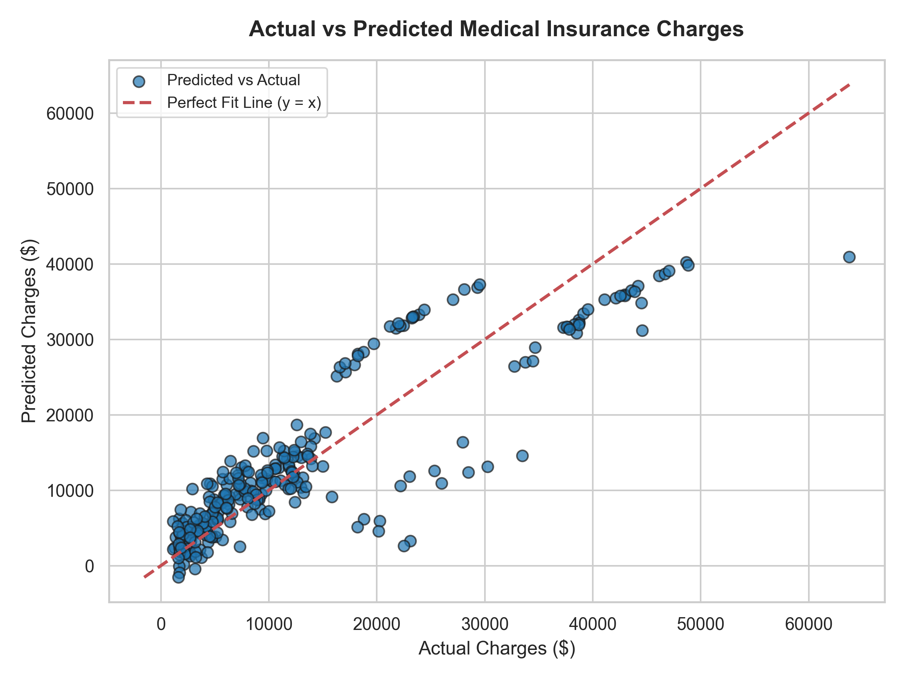

# AI-ML Assignment 1: Medical Insurance Cost Prediction using Multiple Linear Regression

---

## 👤 Student Details

| Attribute | Details |
| :--- | :--- |
| **Name** | **Arsh Baktoo** |
| **Registration Number** | **23BCE10430** |
| **Application Number** | **IN26010763** |
| **Batch Number** | **2(B)** |
| **Email ID** | **arshbaktoo@gmail.com** |
| **GitHub Repository** | [https://github.com/Arshbaktoo/Medical-Insurance-Cost-Prediction-Using-Multiple-Linear-Regression](https://github.com/Arshbaktoo/Medical-Insurance-Cost-Prediction-Using-Multiple-Linear-Regression) |

---

## 📌 1. Objective

The objective of this assignment is to develop and evaluate a **Multiple Linear Regression** model to predict individual medical insurance charges based on customer demographic and health features (such as age, sex, body mass index, number of children, smoking status, and geographic region).

---

## 📊 2. Dataset Information

* **Dataset Name**: Medical Cost Personal Insurance Dataset
* **Source / Link**: [Kaggle - Medical Cost Personal Insurance Dataset](https://www.kaggle.com/datasets/mirichoi0218/insurance)
* **Records**: 1,338 rows
* **Features**:
  * **Numerical Features**: `age`, `bmi`, `children`
  * **Categorical Features**: `sex` (`female`, `male`), `smoker` (`yes`, `no`), `region` (`southwest`, `southeast`, `northwest`, `northeast`)
  * **Target Variable**: `charges` (continuous numerical value in USD)

> *Note: In compliance with assignment rules, `insurance.csv` is excluded from Git tracking via `.gitignore`. Please download the dataset directly from Kaggle and place it in the project root directory before running the scripts.*

---

## 🛠️ 3. Libraries Used

* **Pandas**: Data loading, manipulation, inspection, and missing value checks.
* **NumPy**: Numerical operations and mathematical transformations.
* **Scikit-Learn (`sklearn`)**:
  * `train_test_split`: Splitting data into training (80%) and testing (20%) sets.
  * `LinearRegression`: Model building and training.
  * `mean_absolute_error`, `mean_squared_error`, `r2_score`: Model evaluation.
* **Matplotlib & Seaborn**: Data visualization and plotting Actual vs Predicted values.

---

## ⚙️ 4. Methodology & Workflow

### Task 1: Data Understanding
* Dataset loaded into Pandas DataFrame.
* First 5 records displayed and data types verified.
* Feature categorization into Numerical (`age`, `bmi`, `children`), Categorical (`sex`, `smoker`, `region`), and Target (`charges`).

### Task 2: Data Preprocessing
* Checked for missing values: Confirmed **0 missing values** across all columns.
* Encoded categorical variables using **One-Hot Encoding** (`pd.get_dummies` with `drop_first=True`) to convert categories into numeric binary indicators while avoiding multicollinearity (the dummy variable trap).
* Dataset split into **80% Training set (1,070 samples)** and **20% Testing set (268 samples)** using `random_state=42`.

### Task 3: Model Development
* Built a **Multiple Linear Regression** model using `scikit-learn`.
* Fitted the model on `X_train` and `y_train`.
* Predicted `charges` on `X_test`.

### Task 4: Model Evaluation
* Evaluated predictions using MAE, MSE, RMSE, and $R^2$ Score.
* Generated an **Actual vs Predicted** scatter plot with a perfect fit line ($y=x$).

---

## 📈 5. Results & Performance

### Model Performance Metrics

| Metric | Value |
| :--- | :--- |
| **Mean Absolute Error (MAE)** | **$4,181.19** |
| **Mean Squared Error (MSE)** | **33,596,915.85** |
| **Root Mean Squared Error (RMSE)** | **$5,796.28** |
| **$R^2$ Score (Variance Explained)** | **0.7836 (78.36%)** |

### Feature Coefficients & Intercept

$$\text{Predicted Charges} = -11,931.22 + 256.98(\text{age}) + 337.09(\text{bmi}) + 425.28(\text{children}) - 18.59(\text{sex\_male}) + 23,651.13(\text{smoker\_yes}) - 370.68(\text{region\_northwest}) - 657.86(\text{region\_southeast}) - 809.80(\text{region\_southwest})$$

| Feature | Coefficient ($) | Impact Interpretation |
| :--- | :--- | :--- |
| **Intercept** | -$11,931.22 | Baseline offset |
| **smoker_yes** | **+$23,651.13** | Smoking status is the single dominant factor increasing charges |
| **children** | +$425.28 | Cost increase per dependent child |
| **bmi** | +$337.09 | Cost increase per unit increase in Body Mass Index |
| **age** | +$256.98 | Cost increase per additional year of age |
| **sex_male** | -$18.59 | Marginal difference compared to female baseline |
| **region_northwest** | -$370.68 | Regional variation relative to northeast baseline |
| **region_southeast** | -$657.86 | Regional variation relative to northeast baseline |
| **region_southwest** | -$809.80 | Regional variation relative to northeast baseline |

---

## 🖼️ 6. Actual vs Predicted Plot & Observations



### Key Observations:
1. **High Predictive Accuracy ($R^2 = 0.7836$)**: The model accounts for nearly 78.36% of the variance in insurance costs, indicating strong baseline performance for linear estimation.
2. **Dominance of Smoking Status**: Smoking status (`smoker_yes` coefficient ~ +$23,651.13) is by far the single most influential driver of higher medical expenses.
3. **Non-Linear Interactions & Outliers**: At higher actual charge levels (> $30,000), predictions exhibit higher variance and underestimation. This is due to complex non-linear interactions (e.g., high BMI combined with smoking) that a basic linear model cannot fully capture.

---

## 📝 7. Conclusion

This project developed a Multiple Linear Regression model to estimate medical insurance charges based on customer demographic and health attributes. Key findings demonstrate that lifestyle and physical health metrics are primary drivers of insurance expenditure. Specifically, smoking status exerts the most dominant positive impact, increasing predicted charges by approximately $23,651, followed by age (+$257 per year) and BMI (+$337 per unit). The model achieved an $R^2$ score of 0.7836 and a Mean Absolute Error of $4,181.19. A major limitation of Multiple Linear Regression in this context is its strict assumption of linear, additive relationships. In reality, health risk factors exhibit strong non-linear interactions—such as the compounding effect between high BMI and smoking—which leads to underestimation of extreme charges for high-risk individuals.

---

## 📁 8. Repository Structure

```text
.
├── Assignment-1.ipynb        # Jupyter Notebook containing complete pipeline & visualizations
├── Assignment-1.py           # Executable Python script for the ML model
├── actual_vs_predicted.png   # High-resolution scatter plot of Actual vs Predicted charges
├── .gitignore                # Excludes insurance.csv and temporary files
└── README.md                 # Complete project documentation and submission report
```

---

## 🚀 9. How to Run

1. Clone the repository:
   ```bash
   git clone https://github.com/Arshbaktoo/Medical-Insurance-Cost-Prediction-Using-Multiple-Linear-Regression.git
   cd Medical-Insurance-Cost-Prediction-Using-Multiple-Linear-Regression
   ```
2. Download `insurance.csv` from [Kaggle](https://www.kaggle.com/datasets/mirichoi0218/insurance) and place it in the root folder.
3. Install dependencies:
   ```bash
   pip install pandas numpy scikit-learn matplotlib seaborn
   ```
4. Run the Python script:
   ```bash
   python Assignment-1.py
   ```
   Or open `Assignment-1.ipynb` in Jupyter Notebook / VS Code.
