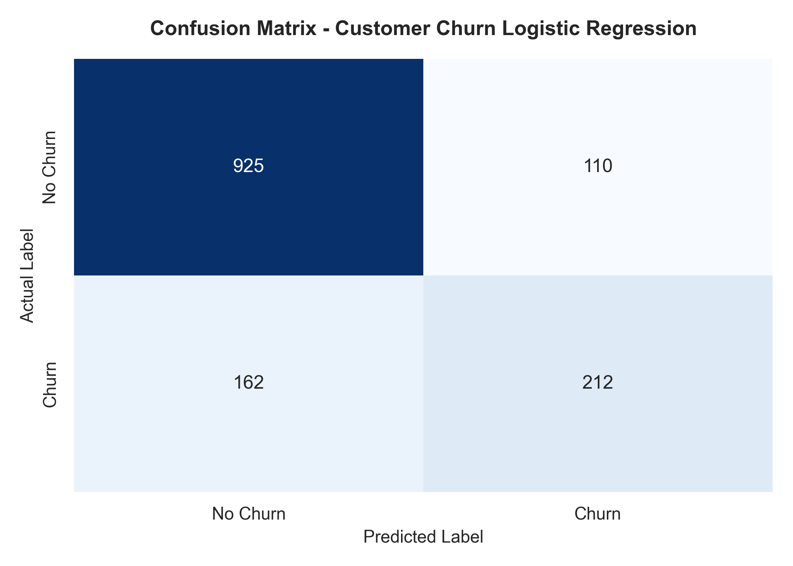
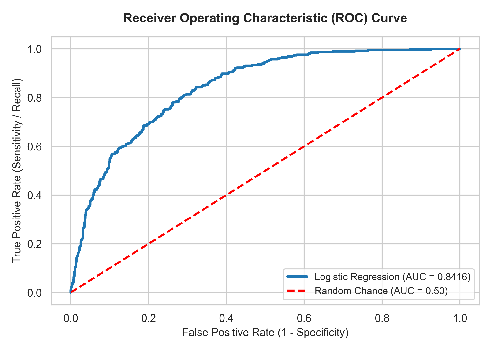

# AI-ML Assignment 2: Customer Churn Prediction using Logistic Regression

---

## 👤 Student Details

| Attribute | Details |
| :--- | :--- |
| **Name** | **Arsh Baktoo** |
| **Registration Number** | **23BCE10430** |
| **Application Number** | **IN26010763** |
| **Batch Number** | **2(B)** |
| **Email ID** | **arshbaktoo@gmail.com** |
| **GitHub Repository** | [https://github.com/Arshbaktoo/Customer-Churn-Prediction-using-Logistic-Regression](https://github.com/Arshbaktoo/Customer-Churn-Prediction-using-Logistic-Regression) |

---

## 📌 1. Objective

The objective of this assignment is to develop, evaluate, and interpret a **Logistic Regression** model for predicting **Customer Churn** in a telecommunications service company. By identifying demographic, account, and service usage patterns associated with customer cancellation, service providers can implement targeted retention strategies.

---

## 📊 2. Dataset Information

* **Dataset Name**: Telco Customer Churn Dataset
* **Source / Link**: [Kaggle - Telco Customer Churn Dataset](https://www.kaggle.com/datasets/blastchar/telco-customer-churn)
* **Total Records**: 7,043 rows $\times$ 21 columns
* **Features**:
  * **Numerical Features**: `tenure`, `MonthlyCharges`, `TotalCharges`, `SeniorCitizen`
  * **Categorical Features**: `gender`, `Partner`, `Dependents`, `PhoneService`, `MultipleLines`, `InternetService`, `OnlineSecurity`, `OnlineBackup`, `DeviceProtection`, `TechSupport`, `StreamingTV`, `StreamingMovies`, `Contract`, `PaperlessBilling`, `PaymentMethod`
  * **Target Variable**: `Churn` (`Yes` = 1, `No` = 0)

> *Note: In compliance with assignment instructions, dataset files (`churn.csv` / `WA_Fn-UseC_-Telco-Customer-Churn.csv`) are excluded from Git tracking via `.gitignore`. Download the dataset directly from Kaggle before running locally.*

---

## 🛠️ 3. Libraries Used

* **Pandas**: Data loading, inspection, missing value handling, and DataFrame transformation.
* **NumPy**: Numeric operations and array handling.
* **Scikit-Learn (`sklearn`)**:
  * `train_test_split`: Stratified 80/20 train-test splitting.
  * `StandardScaler`: Feature scaling for gradient optimization in Logistic Regression.
  * `LogisticRegression`: Classification model development.
  * `accuracy_score`, `precision_score`, `recall_score`, `f1_score`, `confusion_matrix`, `roc_auc_score`, `roc_curve`: Model evaluation metrics.
* **Matplotlib & Seaborn**: Data visualizations including Confusion Matrix heatmap and ROC Curve.

---

## ⚙️ 4. Methodology & Workflow

### Task 1: Data Understanding
* Dataset loaded into a Pandas DataFrame.
* First 5 records inspected.
* Categorized variables into Numerical (`tenure`, `MonthlyCharges`, `TotalCharges`, `SeniorCitizen`), Categorical (`gender`, `Contract`, `PaymentMethod`, etc.), and Target (`Churn`).

### Task 2: Data Preprocessing
* Handled whitespace missing values in `TotalCharges` (coerced to numeric and imputed with median).
* Dropped unique `customerID` identifier.
* Encoded categorical features via **One-Hot Encoding** (`pd.get_dummies` with binary dummy variables).
* Encoded target variable (`Yes`: 1, `No`: 0).
* Applied **Stratified Train-Test Split** (80% Training: 5,634 samples, 20% Testing: 1,409 samples).
* Scaled all predictor features using **`StandardScaler`**.

### Task 3: Model Development
* Built and trained a **Logistic Regression** classifier (`LogisticRegression(max_iter=1000, random_state=42)`).
* Trained model on `X_train_scaled` and predicted class labels (`y_pred`) and probabilities (`y_pred_proba`) on `X_test_scaled`.

### Task 4: Model Evaluation
* Evaluated predictions using Accuracy, Precision, Recall, F1-Score, and ROC-AUC Score.
* Generated **Confusion Matrix** heatmap and **ROC Curve** plot.

---

## 📈 5. Results & Model Performance

### Classification Performance Metrics

| Evaluation Metric | Score | Percentage / Interpretation |
| :--- | :--- | :--- |
| **Accuracy** | **0.8070** | **80.70%** overall correct classifications |
| **Precision (Churn Class)** | **0.6584** | **65.84%** of predicted churners actually churned |
| **Recall (Churn Class)** | **0.5668** | **56.68%** of true churners correctly identified |
| **F1-Score (Churn Class)** | **0.6092** | Harmonic mean of Precision and Recall |
| **ROC-AUC Score** | **0.8416** | Strong discriminative ability between classes |

---

## 🖼️ 6. Visualizations & Observations

### Visualizations

#### Confusion Matrix & ROC Curve
  


### Key Observations:
1. **High Overall Accuracy & Discrimination ($80.70\%$, $\text{ROC-AUC} = 0.8416$)**: The Logistic Regression model effectively distinguishes between customers who churn and those who renew.
2. **Impact of Class Imbalance on Recall**: Non-churners represent ~73.5% of the dataset. With standard 0.5 classification thresholding, Recall for the churn class sits at **56.68%** while Precision is **65.84%**.
3. **Primary Drivers of Churn**: Short customer tenure, month-to-month contract terms, higher monthly charges, and fiber optic internet subscriptions serve as the top positive predictors of customer churn.

---

## 📝 7. Conclusion

This project implemented a Logistic Regression model to predict customer churn in a telecommunications service provider. The model demonstrated robust predictive capability, achieving an accuracy of 80.70% and an ROC-AUC score of 0.8416 on the test dataset. Feature analysis reveals that customer tenure, contract length (month-to-month contracts), monthly charges, and internet service type are the primary drivers influencing churn probability. Customers with short tenure and month-to-month subscriptions exhibit significantly higher churn risk. A key limitation of standard Logistic Regression in customer churn prediction is its linear decision boundary assumption and sensitivity to class imbalance. Since retaining churn-prone customers is vital, future improvements should incorporate threshold tuning, class weighting, or non-linear ensemble models (e.g., Random Forest or XGBoost) to boost recall for high-risk customers.

---

## 📁 8. Repository Structure

```text
.
├── Assignment-2.ipynb        # Complete Jupyter Notebook for Assignment 2
├── Assignment-2.py           # Executable Python script for Logistic Regression pipeline
├── confusion_matrix.png      # Confusion Matrix heatmap plot
├── roc_curve.png             # Receiver Operating Characteristic (ROC) curve plot
├── .gitignore                # Excludes dataset and temporary files
└── README.md                 # Project documentation and submission report
```

---

## 🚀 9. How to Run

1. Clone the repository:
   ```bash
   git clone https://github.com/Arshbaktoo/Customer-Churn-Prediction-using-Logistic-Regression.git
   cd Customer-Churn-Prediction-using-Logistic-Regression
   ```
2. Download `churn.csv` from [Kaggle - Telco Customer Churn](https://www.kaggle.com/datasets/blastchar/telco-customer-churn) and place it in the project root.
3. Install required libraries:
   ```bash
   pip install pandas numpy scikit-learn matplotlib seaborn
   ```
4. Execute the Python script:
   ```bash
   python Assignment-2.py
   ```
   Or open `Assignment-2.ipynb` in Jupyter Notebook / VS Code.
